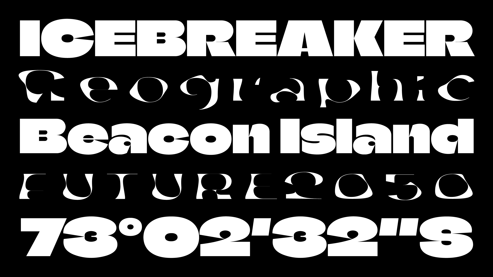

# Climate Crisis

Climate Crisis, is a variable font designed to help visualise the urgency of climate change, designed for Helsingin Sanomat, the largest Nordic newspaper. The typeface’s weight responds to the levels of Arctic sea ice from 1979 to 2019 and predictions for 2050, based on data from the National Snow and Ice Data Center. Case study at [www.typetoact.com](https://kampanjat.hs.fi/climatefont/index.html).

## License
Climate Crisis is licensed under SIL Open Font License V1.1, read [here](https://github.com/dancoull/ClimateCrisis/blob/main/OFL.txt).

## Contributions
If you would like to contribute to the project with ideas or feedback, contact hello@danielcoull.com.

Designed by Eino Korkala & Daniel Coull.
